# GCP WIF 串接 Microsoft Entra ID 存取 Gemini Enterprise 部署與維護 SOP

> 本文件旨在指導如何透過 GCP **員工身分聯盟**（Workforce Identity Federation, 以下簡稱 **WIF**）串接 **Microsoft Entra ID**（原 Azure AD），並採用安全性最高的 **OIDC 授權碼流（Authorization Code Flow）**，實現單一登入（SSO），讓公司員工可以直接用原本的 Microsoft 帳號密碼登入使用 **Gemini Enterprise**，不需要另外申請 Google 帳號。

本文件所有截圖、指令、參數均來自一次真實部署的完整紀錄，並已對照 [Google Cloud 官方文件](https://cloud.google.com/iam/docs/workforce-sign-in-microsoft-entra-id) 與 Microsoft Entra 官方說明校對過正確性。文件中原始版本有幾個名稱前後不一致的地方（例如指令範例混用了舊專案代號），本版本已統一修正，並額外補充「不熟悉 IT 的人也能照做」的細節與名詞解釋。

---

## 目錄

1. [這份文件在做什麼？（給非 IT 背景的讀者）](#這份文件在做什麼給非-it-背景的讀者)
2. [名詞小辭典](#名詞小辭典)
3. [整體流程總覽](#整體流程總覽)
4. [開始之前：你需要準備的權限與工具](#開始之前你需要準備的權限與工具)
5. [系統架構參數表](#系統架構參數表)
6. [Phase 1：Microsoft Entra ID 端設定](#phase-1microsoft-entra-id-端設定)
7. [Phase 2：GCP Workforce Identity Federation 設定](#phase-2gcp-workforce-identity-federation-設定)
8. [Phase 3：GCP 專案權限與 Gemini 授權設定](#phase-3gcp-專案權限與-gemini-授權設定)
9. [Phase 4：驗證與登入](#phase-4驗證與登入)
10. [疑難排解與錯誤排除](#疑難排解與錯誤排除)
11. [參考資料](#參考資料)

---

## 這份文件在做什麼？（給非 IT 背景的讀者）

簡單來說，這件事情要解決的問題是：**「員工要怎麼用公司原本的帳號密碼，登入 Gemini Enterprise？」**

在沒有做這個設定之前，員工要使用 Gemini Enterprise（Google 的企業版 AI 助理），必須額外擁有一個 Google 帳號，IT 也得手動一個一個幫員工在 GCP 上開通權限，管理上非常麻煩，也容易有資安漏洞（例如離職員工的 Google 帳號忘記關閉）。

做完這份 SOP 之後：

- 員工只要用**原本登入電腦、Outlook 用的 Microsoft 帳號密碼**，就可以直接登入 Gemini Enterprise。
- IT 只需要在 Microsoft Entra ID 那邊管理「誰在哪個群組」，GCP 這邊會自動辨識這個人屬於哪個群組、能不能用 Gemini Enterprise，**不用在 GCP 裡幫每個人單獨開帳號**。
- 員工離職時，IT 只要在 Microsoft 那邊停用帳號，GCP 這邊的存取權就會自動失效，管理更安全。

整個流程分成 4 個階段（Phase），你會在 Microsoft 那邊設定一次、在 Google Cloud 那邊設定一次，兩邊「握手」建立信任關係後，就完成了。

---

## 名詞小辭典

| 名詞 | 白話說明 |
|---|---|
| **WIF（Workforce Identity Federation，員工身分聯盟）** | Google Cloud 提供的功能，讓「非 Google 帳號」（例如公司的 Microsoft 帳號）也能登入並使用 GCP 資源，不用另外幫每個人開 Google 帳號。 |
| **Entra ID（原 Azure AD）** | Microsoft 的雲端帳號系統，公司同事平常登入 Windows、Outlook、Teams 用的帳號密碼都存在這裡。 |
| **OIDC（OpenID Connect）** | 一種業界標準的「身分驗證協定」，讓不同公司的系統（這裡是 Google 跟 Microsoft）可以安全地互相確認「這個人是誰」。 |
| **授權碼流（Authorization Code Flow）** | OIDC 底下最安全的一種登入方式，使用者的帳密只會在瀏覽器與 Microsoft 之間傳遞，Google 那邊拿到的是一組一次性的「授權碼」，不會直接接觸到密碼，安全性最高。 |
| **SSO（Single Sign-On，單一登入）** | 只要登入一次，就能通行多個系統，不用每個系統都重新輸入帳密。 |
| **IdP（Identity Provider，身分提供者）** | 「負責確認你是誰」的系統，這裡指的就是 Microsoft Entra ID。 |
| **Workforce Pool（員工身分集區）** | 在 GCP 裡建立的一個「容器」，用來裝所有透過 Microsoft Entra ID 登入進來的員工身分。 |
| **Workforce Provider（身分提供者設定）** | Workforce Pool 裡面實際跟 Microsoft Entra ID 對接的設定，記錄了憑證、對應規則等技術細節。 |
| **Client ID / Client Secret（用戶端識別碼 / 用戶端密碼）** | 可以想像成 Google 這個「應用程式」在 Microsoft 那邊登記的帳號和密碼，用來證明「來要求登入的真的是 Google，不是別人冒充的」。 |
| **Tenant ID（租戶識別碼）** | 你公司在 Microsoft 雲端裡的專屬識別碼，全世界獨一無二。 |
| **IAM（Identity and Access Management）** | Google Cloud 的「權限管理系統」，決定「誰」可以對「哪個資源」做「什麼事」。 |
| **群組宣告（Group Claim）** | 讓 Microsoft 在核發登入憑證時，順便夾帶「這個人屬於哪些群組」的資訊，GCP 才能依照群組決定權限。 |

---

## 整體流程總覽

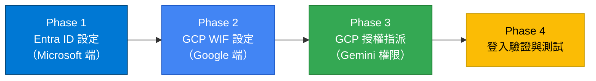

完成設定後，員工實際登入時，背後的驗證流程如下（不需要動手操作，僅供理解原理）：

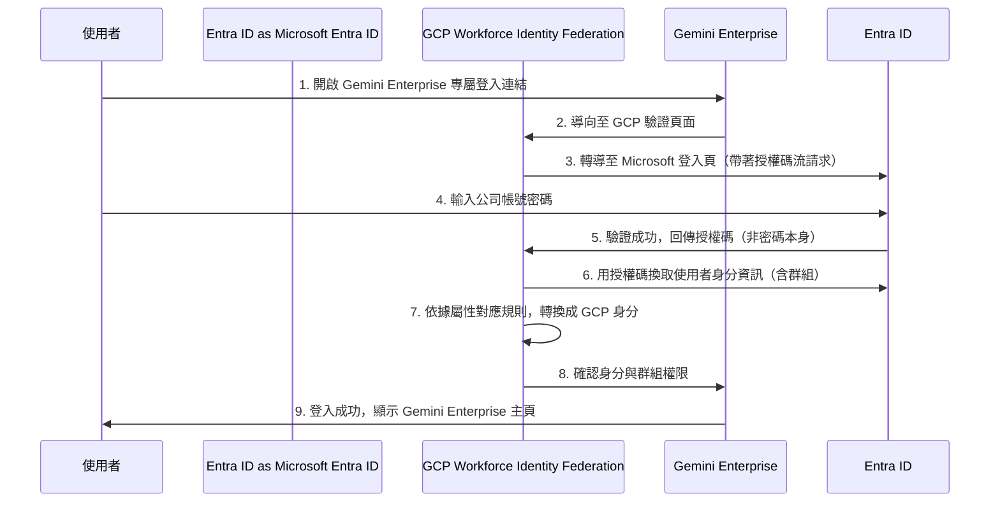

---

## 開始之前：你需要準備的權限與工具

原始文件沒有特別列出前置需求，這裡依照 Google 官方文件補充，**建議在動手前先確認以下事項，避免做到一半卡住**：

### Microsoft Entra ID 端

- 一個具備 **全域管理員（Global Administrator）** 或至少 **應用程式管理員（Application Administrator）** 權限的帳號，才能新增應用程式、設定 API 權限、並「代表組織授與管理員同意」。
- 確認貴公司要開放使用 Gemini Enterprise 的員工，已經有對應的 **Microsoft 365 / Entra ID 群組**（若還沒有，先建立好，成員可以之後再慢慢加）。

### Google Cloud 端

- 一個 GCP **組織（Organization）**，並取得 **GCP Organization ID**（純數字，例如本文件範例中的 `705380188382`）。
- 一個具備組織層級 **IAM Workforce Pool Admin（`roles/iam.workforcePoolAdmin`）** 角色的帳號 —— 這是 Google 官方文件明確要求的權限，若沒有這個角色，執行 Phase 2 的 `gcloud iam workforce-pools` 指令會直接失敗。
- 已安裝並登入 [Google Cloud CLI](https://cloud.google.com/sdk/docs/install)（`gcloud init` 完成初始化）。
- 一個用來測試的 GCP 專案（測試專案 ID），並確認已啟用計費（Billing）。

> **小提醒**：Phase 1、Phase 2 建議由同一位同時具備上述兩邊權限的窗口（或跨部門兩人搭配）完成，因為過程中兩邊的設定值需要互相複製貼上（例如 Redirect URI 要從 GCP 複製到 Microsoft，Client Secret 要從 Microsoft 複製到 GCP）。

---

## 系統架構參數表

正式操作前，建議先把以下欄位填好，操作過程中會重複用到，統一記錄可以避免複製貼上錯誤。

| 參數項目 | 範例值（本次部署實際值） | 說明 |
|---|---|---|
| GCP 組織 ID | `705380188382` | GCP Organization ID |
| GCP 測試專案 ID | *你的 GCP 測試專案 ID* | 啟用 Gemini API 與指派 IAM 的專案 |
| GCP WIF 集區 ID（Workforce Pool ID） | `ge-entraid-pool` | 建議全公司統一用小寫英文+連字號，之後不可再重複使用相同名稱（詳見〔疑難排解 錯誤 2〕） |
| GCP WIF 提供者 ID（Workforce Provider ID） | `entra-id-provider` | 同上，命名越清楚，未來維護越輕鬆 |
| Entra ID 租戶 ID（Tenant ID） | `545e3a6c-943f-41f0-805d-c204df049f94` | Microsoft Tenant ID，在 Entra 管理中心「概觀」頁可查到 |
| Entra ID 應用程式 ID（App / Client ID） | `67598759-8f0d-477d-b256-04473b4c6f23` | 在應用程式「屬性」頁複製 |
| Entra ID 群組 ID（Group Object ID） | `f20f1a8c-1578-48f1-9aac-9d26bd0cd2c1` | 允許使用 Gemini Enterprise 的員工群組，其「物件識別碼」 |

> ⚠️ **原始文件的命名不一致，本版本已統一修正**：原文件在 Phase 2 的指令範例中誤用了舊專案代號 `hncb-id-pool`／`hncbentraid`／`hncb-entra-id-provider`，與這張參數表及後面所有畫面截圖顯示的 `ge-entraid-pool`／`entra-id-provider` 不一致（推測是沿用舊 SOP 模板時忘記全部替換）。本文件後續所有指令已統一改為與參數表一致的名稱，請依照**你自己的命名**填入，不要照抄範例值。

---

## Phase 1：Microsoft Entra ID 端設定

### 步驟 1：新增應用程式註冊（App Registration）

1. 登入 [Microsoft Entra 管理中心](https://entra.microsoft.com)。
2. 前往「企業應用程式」>「新增應用程式」。

   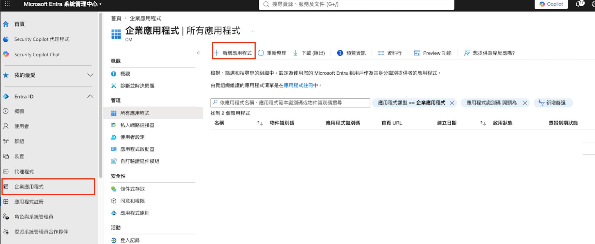

3. 在應用程式資源庫中找到「**Google Cloud Platform**」（顯示為 *Google Cloud / G Suite Connector by Microsoft*）：
   - 名稱：可輸入自訂名稱，或維持預設。

   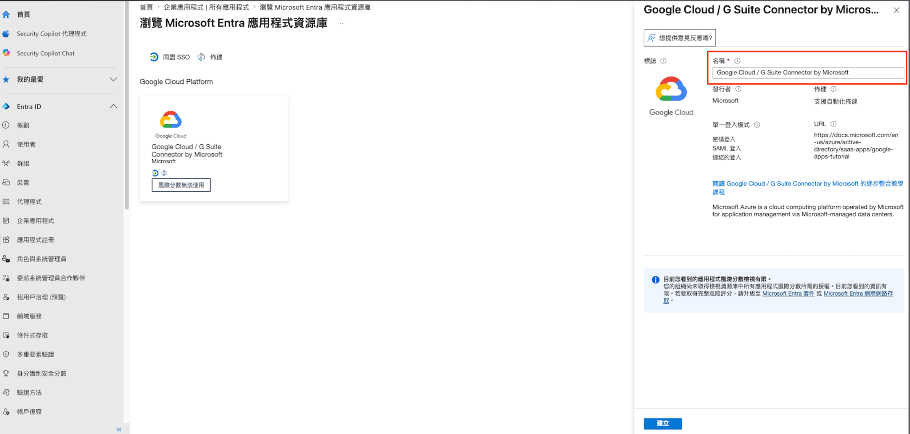

4. 註冊成功後，至「屬性」頁面：
   - 複製**應用程式（用戶端）ID**，並儲存在記事本（對應參數表的「Entra ID 應用程式 ID」）。
   - 確認「**需要指派**」設定為「**是**」——這代表只有被明確加入群組/被指派的人才能使用這個應用程式登入，是重要的資安設定，請務必確認。
   - 另外找到「**租用戶識別碼**」（Tenant ID）並複製儲存。

   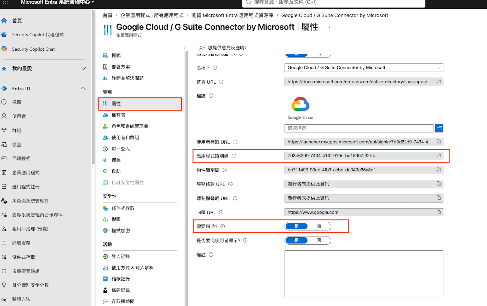

> 💡 **補充說明（原文件未提及）**：這裡使用的是 Microsoft Entra 應用程式資源庫（Gallery）中預先建好的「Google Cloud / G Suite Connector by Microsoft」範本，它原本主要是給「Google Workspace 帳號 SAML 單一登入」使用的。若貴公司**已經**在用這個範本做 Google Workspace 的 SSO，直接沿用同一個應用程式來加掛本文件的 OIDC 設定，可能會互相影響。若有疑慮，也可以改用 Google 官方建議的做法：直接到「應用程式註冊」>「新增註冊」，建立一個全新的、專門給 WIF 使用的應用程式，效果相同、更乾淨。

### 步驟 2：配置選用宣告（Optional Claims / 群組宣告）

為了讓 GCP 能夠識別使用者屬於哪個群組（進而判斷有沒有權限），必須讓 Microsoft 核發的驗證憑證（Token）中夾帶群組資訊。

1. 在應用程式選單點選「**權杖設定（Token configuration）**」。
2. 點選「**新增群組宣告**」：
   - 群組類型：選擇「**指派給應用程式的群組**」（這樣 Token 中才只會帶出真正跟這個應用程式相關的群組，避免夾帶使用者所有群組造成 Token 過大或洩漏不必要資訊）。
   - 確認權杖屬性的「識別碼」為「**群組識別碼**」。
   - 點選「新增」。

   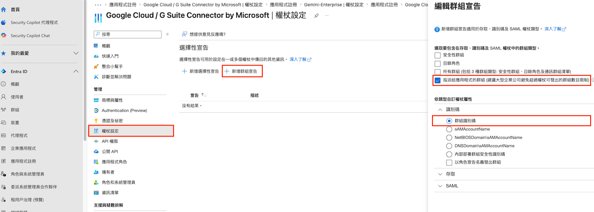

### 步驟 3：建立用戶端密碼（Client Secret）

此步驟為「授權碼流（Authorization Code Flow）」安全驗證必備，Google 那邊要靠這組密碼證明自己的請求是合法的。

1. 點選「**憑證及祕密（Certificates & secrets）**」>「**新增用戶端密碼（New client secret）**」。
2. 設定說明與過期時間（建議 1-2 年，並在行事曆上記得到期前提醒自己更新，否則到期當天登入會全面失敗）。
3. 【**極重要**】新增後，**立刻複製「值（Value）」欄位的值**（不是「祕密識別碼 / Secret ID」）。離開這個頁面之後，這個值就會被遮蔽、再也看不到，只能重新產生一組新的。

   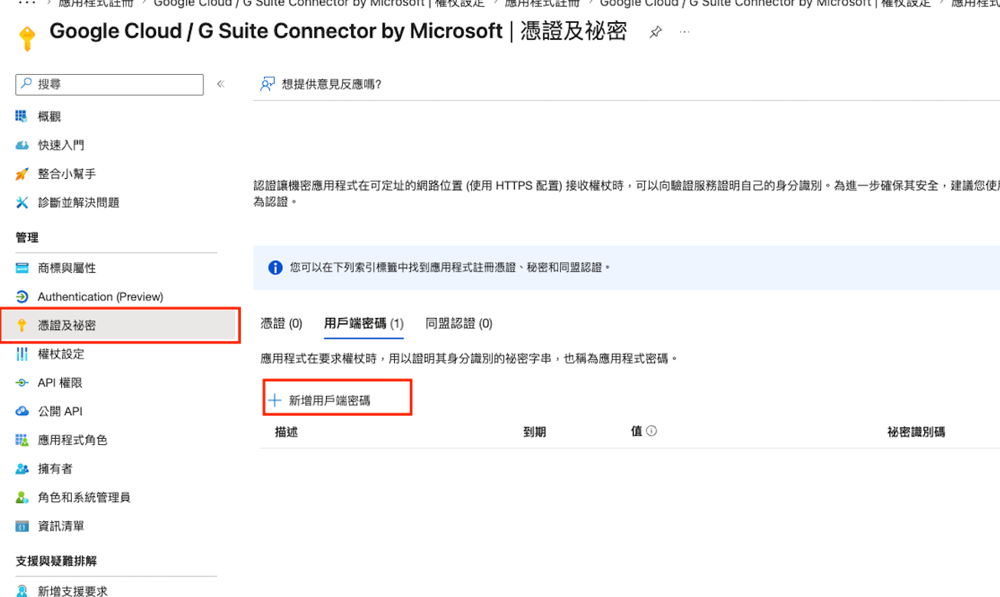

> ⚠️ 這一步是最多人卡關的地方，詳見〔疑難排解 錯誤 4〕。

### 步驟 4：設定 API 權限

為了讓 GCP WIF 能透過 OpenID Connect（OIDC）正常驗證使用者身分，必須授與應用程式讀取基本個人資料的權限，並完成全域管理員同意。

1. 在應用程式選單點選「**API 權限**」，接著點選「**+ 新增權限**」。
2. 在 API 清單中點選「**Microsoft Graph**」。
3. 選擇權限類型為「**委派的權限（Delegated permissions）**」（代表這個應用程式是代表「登入者本人」去存取資料，而不是用系統身分背景執行）。
4. 展開「**OpenId 權限**」區塊，勾選以下兩項核心權限：
   - **openid**：允許進行 OpenID Connect 身分驗證並發放 ID Token（SSO 單一登入必備）。
   - **profile**：允許 GCP 讀取使用者的基本個人資料（如顯示名稱、帳號名稱）。
5. 點選頁面底部的「**新增權限**」按鈕。

   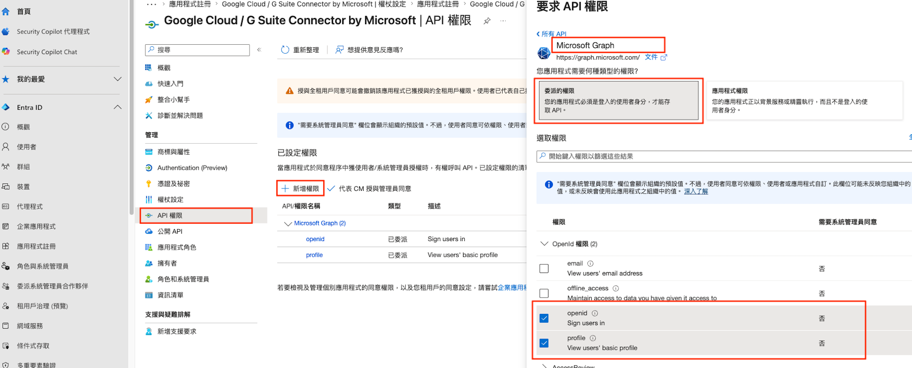

6. 回到「API 權限」主畫面，點選上方選單的「**代表〈您的組織名稱〉授與管理員同意**」（Grant admin consent）。
7. 在彈出的確認視窗中點選「**是**」。
8. 確認「狀態」欄位顯示為**綠色勾勾**（已授與）——這一步沒做，一般使用者登入時會卡在「需要管理員同意」的畫面，無法自行通過。

   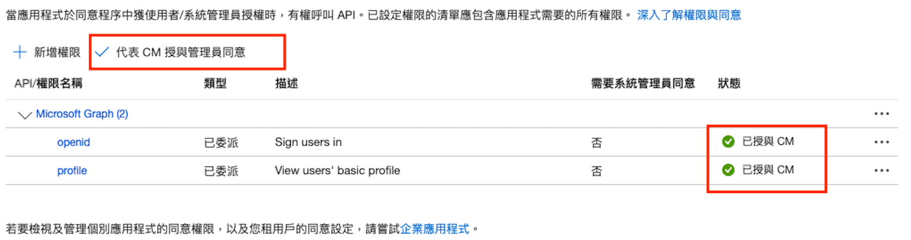

### 步驟 5：加入群組

1. 新增（或使用既有）群組，並將需要使用 Gemini Enterprise 的人員加入群組。
2. 複製群組的「**物件識別碼**」，並儲存在記事本（對應參數表的「Entra ID 群組 ID」）。
3. 將這個群組加入到剛剛建立的應用程式（「使用者和群組」頁籤 >「新增使用者/群組」），這一步也是「步驟 2」群組宣告能正確運作的前提——**沒有把群組指派給應用程式，Token 裡就不會帶出這個群組的資訊**。

### 步驟 6：設定 Redirect URI（重新導向網址）

> 這一步需要等 **Phase 2 建立好 GCP 的 Provider** 之後，才會有正確的網址可以填，所以文件把它放在最後，實際操作時請照著〔Phase 2 步驟 3〕的指示回頭完成。

1. 點選「**Authentication (Preview)**」（即驗證設定頁面）。
2. 在「重新導向 URI 設定」頁籤中，點選「新增重新導向 URL」，選擇「**Web**」。
3. 輸入 GCP WIF 的標準 Callback 網址（格式如下，稍後從 GCP 複製）：

   ```
   https://auth.cloud.google/signin-callback/locations/global/workforcePools/{WORKFORCE_POOL_ID}/providers/{WORKFORCE_PROVIDER_ID}
   ```

4. 點選「設定」。

   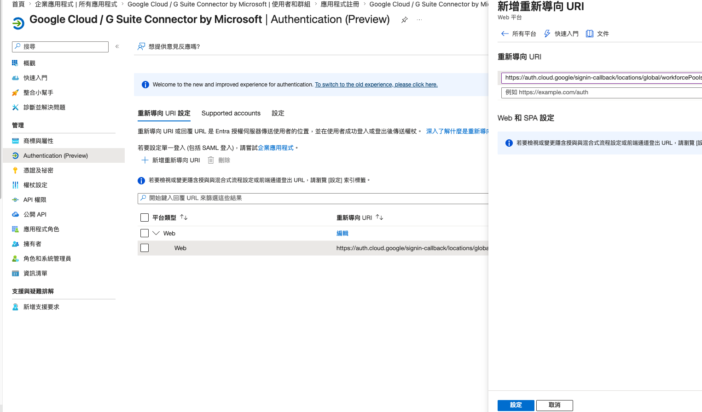

---

## Phase 2：GCP Workforce Identity Federation 設定

請在 [GCP Cloud Shell](https://console.cloud.google.com) 中執行以下指令。以下指令已將原文件中不一致的 Pool／Provider 名稱，統一改為與〔系統架構參數表〕一致的 `ge-entraid-pool` 與 `entra-id-provider`，**請自行替換成你自己規劃的名稱**。

### 步驟 1：建立（或還原）Workforce Pool（員工身分集區）

若先前已建立同名 Pool 但已刪除，Google 會將它保留在「軟刪除」狀態 30 天，此時須執行**還原**指令，而不是重新建立（否則會遇到〔疑難排解 錯誤 2〕）：

```bash
gcloud iam workforce-pools undelete ge-entraid-pool --location=global
```

若為全新建立，請執行：

```bash
gcloud iam workforce-pools create ge-entraid-pool \
  --organization=GCP_ORG_ID \
  --location=global \
  --display-name="GE Entra ID Pool" \
  --description="員工透過 Microsoft Entra ID 登入 GCP / Gemini Enterprise 使用的身分集區"
```

**參數說明（給不熟指令的人）：**

| 參數 | 意思 |
|---|---|
| `ge-entraid-pool` | 這個集區的 ID，全域唯一，之後不能改也不能重複使用，請取一個好辨識的名字 |
| `--organization` | 填入〔系統架構參數表〕的 GCP 組織 ID |
| `--location=global` | 固定填 `global` 即可，代表這個集區不限特定地區 |
| `--display-name` | 顯示在 GCP 主控台上的名稱，可以用中文，方便日後其他同事辨識 |
| `--description` | 給自己或其他管理員看的備註説明 |

### 步驟 2：建立 OIDC 提供者（Provider）

使用安全性較高的授權碼流建立與 Entra ID 的連接：

```bash
gcloud iam workforce-pools providers create-oidc entra-id-provider \
  --workforce-pool=ge-entraid-pool \
  --location=global \
  --display-name="Microsoft Entra ID" \
  --description="讓 Entra ID 使用者登入並存取 GCP / Gemini Enterprise" \
  --issuer-uri="https://login.microsoftonline.com/租用戶識別碼/v2.0" \
  --client-id="應用程式（用戶端）識別碼" \
  --client-secret-value="你的微軟用戶端密碼值（Value）" \
  --web-sso-response-type="code" \
  --web-sso-assertion-claims-behavior="merge-user-info-over-id-token-claims" \
  --attribute-mapping="google.subject=assertion.preferred_username,google.display_name=assertion.name,google.groups=assertion.groups"
```

**關鍵設定說明：**

- `--web-sso-response-type="code"`：指定使用「授權碼流」，這是官方文件建議的最安全做法。
- `--web-sso-assertion-claims-behavior` 必須為 `merge-user-info-over-id-token-claims`：讓 GCP 同時參考 ID Token 與使用者資訊端點（userinfo）回傳的內容，避免因為某些欄位只出現在其中一個地方而讀不到資料。
- `--attribute-mapping`：決定 Microsoft 的欄位怎麼「翻譯」成 GCP 認得的欄位。
  - `google.subject`：GCP 用來識別「這是哪一個使用者」的唯一鍵值，等同於這個人在 GCP 世界的身分證字號。
  - `google.display_name`：顯示名稱。
  - `google.groups`：群組資訊，GCP 之後靠這個判斷使用者能不能用 Gemini Enterprise。

> 📌 **關於 `google.subject` 對應值的選擇（官方建議 vs. 本次實際採用）**
>
> - **Google 官方文件建議**使用 `assertion.oid`（Entra ID 內部的物件識別碼，終身不變、最穩定），語法為：`google.subject=assertion.oid`。
> - **本文件實際採用** `assertion.preferred_username`（使用者的登入帳號，例如 `name@company.com`），原因是實際部署時發現：若組織剛建立、測試帳號還沒有設定信箱（Mailbox），會導致 `assertion.email` 欄位是空的而報錯（詳見〔疑難排解 錯誤 5〕），而 `preferred_username` 不論有無信箱都一定存在。
> - **兩者如何選擇**：如果貴公司員工帳號的「使用者名稱（UPN）」未來可能會變動（例如改名、換部門信箱），建議改用 `assertion.oid`，因為它不會變；如果需要在 GCP 稽核紀錄裡直接看到「可讀的帳號名稱」方便日常排查，`preferred_username` 會比較直覺。兩種做法都是官方支援的合法選項，可依需求擇一。

### 步驟 3：更新 Entra ID 應用程式的重新導向 URL

1. 點選到剛剛建立的 Provider 項目。
2. 找到「**重新導向網址**」並複製。

   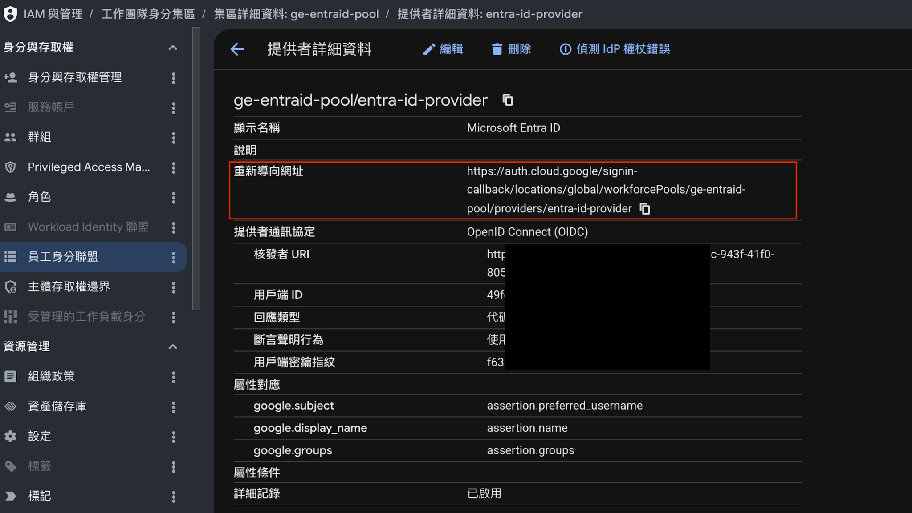

3. 回到 Entra ID 剛剛建立的應用程式，貼上並更新 Redirect URI（回頭完成〔Phase 1 步驟 6〕）。

> 💡 **建議的驗證小技巧（原文件未提及）**：Google Cloud 控制台在 Provider 詳細資料頁面上方有一個「**偵測 IdP 權杖錯誤（Debug IdP token）**」按鈕（如上圖左上角），可以在正式串接應用程式（Gemini Enterprise）之前，先單獨測試 Microsoft 那邊回傳的 Token 內容是否正確、屬性有沒有對應成功，能提早抓出問題，不用等到員工反映登入失敗才排查。

---

## Phase 3：GCP 專案權限與 Gemini 授權設定

### 步驟 1：啟用測試專案的 Gemini API

```bash
# 1. 切換至測試專案
gcloud config set project 你的GCP測試專案ID

# 2. 啟用 Cloud AI Companion API（Gemini API）等必要服務
gcloud services enable \
  aiplatform.googleapis.com \
  discoveryengine.googleapis.com \
  storage.googleapis.com \
  iam.googleapis.com
```

### 步驟 2：綁定 IAM 角色給整個 WIF 集群

授權整個 WIF 群組的使用者都能使用 Gemini API 及調用專案配額，不用一個一個手動加：

```bash
gcloud projects add-iam-policy-binding 你的GCP測試專案ID \
  --member="principalSet://iam.googleapis.com/locations/global/workforcePools/ge-entraid-pool/group/f20f1a8c-1578-48f1-9aac-9d26bd0cd2c1" \
  --role="roles/discoveryengine.agentspaceUser"
```

> `roles/discoveryengine.agentspaceUser` 是 Google 官方文件定義的「**Gemini Enterprise 使用者**」角色，用來讓使用者「存取、管理與分享」Gemini Enterprise 應用程式，已對照 [Google 官方 IAM 角色文件](https://docs.cloud.google.com/gemini/enterprise/docs/iam-policy-for-apps) 確認為正確角色名稱。
>
> `--member` 裡的 `group/f20f1a8c-...` 要換成〔系統架構參數表〕裡「Entra ID 群組 ID」——這代表「這整個 Microsoft 群組的所有成員」都自動取得這個角色，之後只要在 Microsoft 那邊調整群組成員，GCP 這邊的權限就會自動跟著變動，**不需要每次都重新下指令**。

### 步驟 3：Gemini Enterprise 設定 WIF 驗證

1. 在 GCP 控制台搜尋並進入「**Gemini Enterprise**」。
2. 進入「設定」頁面，並選擇「**驗證**」分頁。
3. 在下方 `global` 位置點選右方的鉛筆符號。

   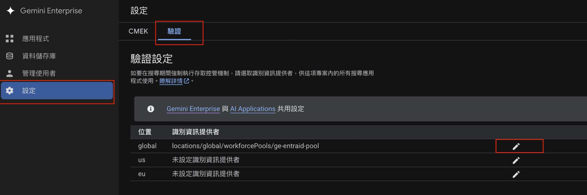

4. 選擇「**第三方身份**」，並在下方選擇剛剛建立的身份集群（`locations/global/workforcePools/ge-entraid-pool`）。

   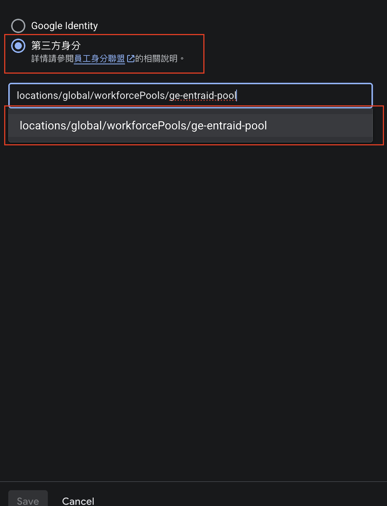

### 步驟 4：啟用 Gemini 授權自動分配（Optional）

1. 在 GCP 控制台搜尋並進入「Gemini Enterprise」。
2. 進入「管理使用者」頁面。
3. 點選「**Enable Automatic License Assignment**」（啟用自動授權指派）——開啟後，符合條件的使用者第一次登入時就會自動取得授權，不需要 IT 手動一個個核發。

---

## Phase 4：驗證與登入

完成以上設定後，WIF 使用者可以透過以下兩種專屬 SSO 連結進行登入測試：

- **登入至 GCP 主控制台**：在「員工身分集區」列表中，可以找到並複製你的 Provider 專屬登入網址。

  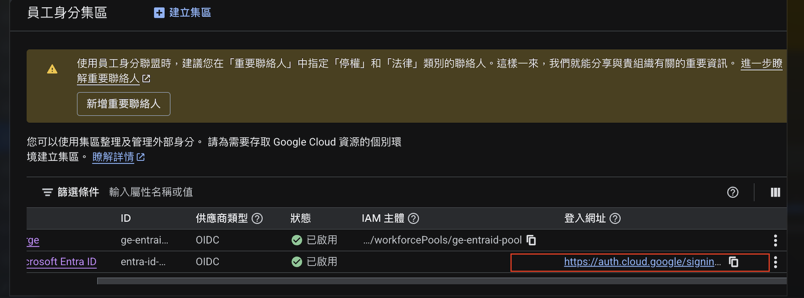

- **登入至 Gemini Enterprise 網頁端專屬介面**：在 Gemini Enterprise 總覽頁「設定網頁應用程式」中可以取得專屬登入連結，分享給員工使用。

  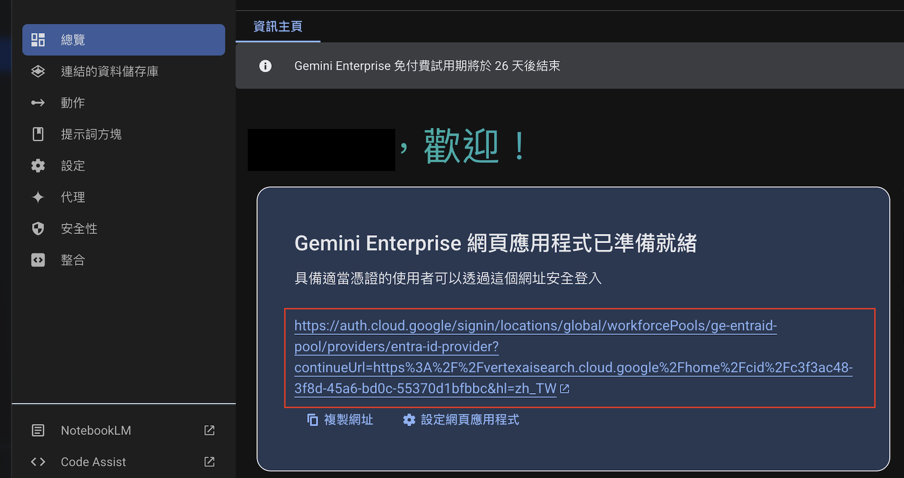

> 🔒 **正式推廣給全公司使用前的建議**：先找 2-3 位不同部門的同事實際測試登入，確認群組權限、顯示名稱都正確無誤後，再把登入連結正式公告給所有員工，避免大規模上線後才發現屬性對應有問題。

---

## 疑難排解與錯誤排除（Troubleshooting）

以下彙整本次部署中遭遇的所有錯誤情境與對應解決方案。

### 錯誤 1：`Gaia id not found for email admin@renshenian.com`

- **事發情境**：在 Cloud Shell 執行 `workforce-pools` 或 `providers` 建立指令時，噴出大量的黃色/白色警告。
- **原因分析**：GCP 組織（Organization）為全新建立，後台的區域存取限制（Regional Access Boundary）中繼資料與 IAM 資料庫尚未同步完成。
- **排除方案**：此警告可安全忽略。若指令最終顯示 `Created workforce pool...`，代表設定已寫入成功。

### 錯誤 2：`Pool locations/global/workforcePools/... already exists`

- **事發情境**：重新建立 Pool 時失敗，但在 GCP 主控台上看不到該 Pool。
- **原因分析**：GCP 限制 Workforce Pool 刪除後會進入 30 天的「軟刪除（Soft-delete）」狀態，期間該 ID 被鎖定，不允許重複建立同名 Pool。
- **排除方案**：
  - **方案 A（推薦）**：改用新的 ID，例如 `ge-entraid-pool-v2`。
  - **方案 B（還原）**：在 Cloud Shell 中執行還原指令：
    ```bash
    gcloud iam workforce-pools undelete ge-entraid-pool --location=global
    ```

### 錯誤 3：`Invalid IdP response (invalid state)`

- **事發情境**：透過專屬登入網址登入時，跳轉回 GCP 出現 Error 400 畫面。
- **原因分析**：
  1. 瀏覽器在無痕模式（Incognito）下預設封鎖了第三方 Cookie，導致 GCP 的防偽安全暗號（State）遺失。
  2. 瀏覽器重複整理網頁，導致緩存的驗證狀態碼過期。
- **排除方案**：
  1. 切換至一般瀏覽器分頁進行登入。
  2. 若必須使用無痕模式，請在網址列旁設定「允許 Cookie」給 `auth.cloud.google` 與 `login.microsoftonline.com`。
  3. 關閉所有無痕視窗後，重新貼上乾淨的登入網址。

### 錯誤 4：`AADSTS7000215: Invalid client secret provided.`

- **事發情境**：輸入微軟帳密後，跳轉回 GCP 出現微軟 Error 400 畫面。
- **原因分析**：在 GCP CLI 中帶入的 `--client-secret-value` 是微軟的「祕密識別碼（Secret ID）」，而非真正的「用戶端密碼值（Value）」——這兩個欄位長得很像，非常容易複製錯。
- **排除方案**：
  1. 回到微軟 Entra ID「憑證及祕密」頁面，重新產生一組 Client Secret。
  2. 立即複製「**值（Value）**」欄位的值（不是 Secret ID）。
  3. 在 GCP Cloud Shell 中執行更新指令，**無須重建整個 Provider**：
     ```bash
     gcloud iam workforce-pools providers update-oidc entra-id-provider \
       --workforce-pool=ge-entraid-pool \
       --location=global \
       --client-secret-value="新產生的值"
     ```

### 錯誤 5：`Could not obtain a value for google.subject from the given credential`

- **事發情境**：登入跳轉時，GCP 出現 Error 400 並提示此錯誤。
- **原因分析**：原本 GCP 端對應設為 `assertion.email`。但因為 Entra ID 是全新建立，測試帳號並無配置實體 Microsoft Exchange 信箱，導致 Token 中的 `email` 欄位為空（Null），GCP 無法讀取。
- **排除方案**：將對應屬性修改為不論有無信箱都一定存在的 `preferred_username`（即微軟的帳號 UPN）。在 Cloud Shell 執行：
  ```bash
  gcloud iam workforce-pools providers update-oidc entra-id-provider \
    --workforce-pool=ge-entraid-pool \
    --location=global \
    --attribute-mapping="google.subject=assertion.preferred_username"
  ```
  > 若貴公司帳號的信箱已經穩定配置好，也可以考慮改用官方更推薦的 `assertion.oid`，理由請見〔Phase 2 步驟 2〕的說明框。

### 錯誤 6：`Error connecting to the given credential's issuer`（Gemini Enterprise 獨有）

- **事發情境**：點擊 Gemini Enterprise 網頁介面上產生的登入連結時出現 Error 400。
- **原因分析**：Gemini Enterprise 應用的設定中，綁定的 Identity Provider ID 是壞掉或舊的（例如 `entra-id-oidc`），而非最後成功啟用的 `entra-id-provider`。
- **排除方案**：
  1. 進入 Gemini Enterprise 控制台，在預設網址下方點選「⚙️ 設定網頁應用程式」。
  2. 將提供者 ID 改為正確的 `entra-id-provider` 並儲存。
  3. （選做）將壞掉的舊 Provider 刪除：
     ```bash
     gcloud iam workforce-pools providers delete-oidc entra-id-oidc \
       --workforce-pool=ge-entraid-pool \
       --location=global \
       --quiet
     ```

### 額外建議：善用官方「Debug IdP token」工具做預防性排查

上述大多數錯誤都跟「Token 裡到底帶了什麼欄位」有關。與其等使用者反映登入失敗才回頭猜測，建議每次調整 `--attribute-mapping` 後，都先到 GCP 主控台的 Provider 詳細資料頁點選「**偵測 IdP 權杖錯誤**」，用測試帳號跑一次，直接看到 Microsoft 回傳的原始欄位內容，再決定怎麼對應，會比反覆嘗試更有效率。

---

## 參考資料

- [Google Cloud：Configure Workforce Identity Federation with Microsoft Entra ID and sign in users（官方文件）](https://docs.cloud.google.com/iam/docs/workforce-sign-in-microsoft-entra-id)
- [Google Cloud：Workforce Identity Federation 總覽](https://docs.cloud.google.com/iam/docs/workforce-identity-federation)
- [Google Cloud：Configure identity provider for Gemini Enterprise（官方文件）](https://docs.cloud.google.com/gemini/enterprise/docs/configure-identity-provider)
- [Google Cloud：Gemini Enterprise IAM 角色與權限](https://docs.cloud.google.com/gemini/enterprise/docs/iam-policy-for-apps)
- [gcloud CLI：`iam workforce-pools providers create-oidc` 指令參考](https://cloud.google.com/sdk/gcloud/reference/iam/workforce-pools/providers/create-oidc)

---

*本文件內容涉及公司內部真實系統參數（組織 ID、租戶 ID、應用程式 ID、群組 ID 等），請妥善保管本 Repository 的存取權限，勿設為公開（Public）。*
